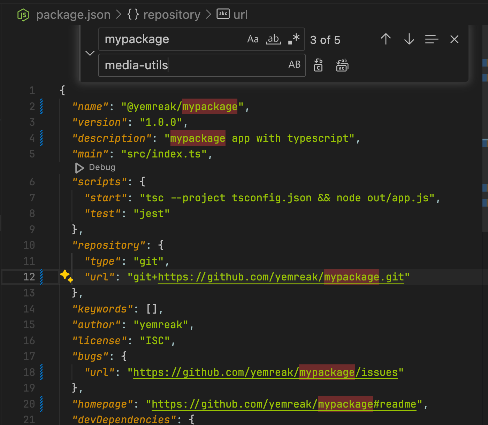

# npm-package-template

## Getting Started

To get started with this npm package template, follow these steps:


1. To ensure that TypeScript automatically appends the `.js` extension, add the following line to your `settings.json` file
	```json
   	"typescript.preferences.importModuleSpecifierEnding": "js",
 	```
3. Clone the repository to your local machine.
4. Navigate to the project directory.
5. In your `package.json`, use VSCode Find and Replace feature to change all instances of 
	- `mypackage` to your own package name
	- `yemreak` to your own author name
	- 
6. Delete `docs` directory
7. Install the dependencies by running the following command:
	```zsh
	npm install
	```
8. Remember to put your `d.ts` files in the `types` directory
9. To add a new user to npm registry, run:
	```zsh
	npm adduser
	```
10. To publish the package to the **public** npm registry, run:
	```zsh
	npm publish --access public
	```
## `tsconfig.json`

- **Target: `ESNext`** - Uses the most recent ECMAScript version, allowing the use of latest features but may include unstable features
- **Module: `ESNext`** - Adopts the latest module system, which supports modern tooling but may not be compatible with older environments
- **OutDir: `./out`** - Directs compiled files to a specific directory, keeping source files clean but requires directory management
- **RootDir: `./src`** - Specifies the root folder for source files, organizing code effectively but necessitating correct path settings
- **ModuleResolution: `Bundler`** - Delegates resolution logic to a bundler, simplifying module handling while increasing dependency on external tools
- **esModuleInterop: `true`** - Facilitates importing CommonJS modules into ES modules, increasing compatibility but potentially obscuring module differences
- **ForceConsistentCasingInFileNames: `true`** - Prevents casing issues in module imports, enhancing portability but requiring consistent file naming
- **Strict: `true`** - Enforces strict typing, improving code reliability but increasing complexity in type management
- **SkipLibCheck: `true`** - Skips checking of declaration files to speed up compilation, though may miss type errors in library definitions
- **ResolveJsonModule: `true`** - Allows importing JSON files directly into TypeScript files, increasing ease of use but adding more steps to the build process
- **SourceMap: `true`** - Generates source map files for debugging, improving developer experience but slightly increasing output size
- **Declaration: `true`** - Generates type declaration files automatically, beneficial for library authors but adds to the compilation time
- **Incremental: `true`** - Reduces build times by using incremental compilation, enhancing performance but may lead to incomplete recompiles if not managed correctly
- **StrictNullChecks: `true`** - Forces explicit handling of `null` and `undefined`, increasing type safety but requiring more thorough initialization checks
- **Include: `src/**/*.ts`** - Ensures all relevant files are included, simplifying project setup but requiring correct glob patterns
- **Exclude: `node_modules`, `**/*.spec.ts`** - Prevents unnecessary files from being compiled, reducing clutter but requiring explicit exclusion patterns

## Extension Suggestion

[](https://marketplace.visualstudio.com/items?itemName=vespa-dev-works.jestRunIt)
[](https://marketplace.visualstudio.com/items?itemName=yemreak.mindease-vscode-theme)
